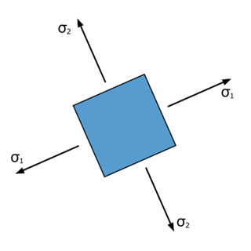
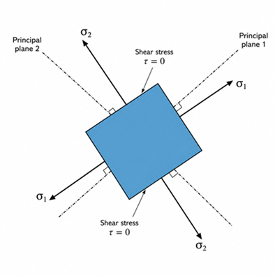

### Physical Concept

Structural and machine components are often subjected to forces acting in multiple directions simultaneously. As a result, both normal and shear stresses may exist at a point within the material. Such a condition is known as a **plane stress** state when the stresses act in a two-dimensional plane.

Although stresses may initially act on arbitrary planes, there always exists a particular orientation where the shear stress becomes zero. The normal stresses acting on these mutually perpendicular planes are called the **principal stresses**. These are the maximum and minimum normal stresses experienced by the material and are fundamental in predicting yielding and failure.

<b>Figure 1. Plane stress element subjected to normal and shear stresses.</b>

By rotating the stress element to the principal planes, the shear stress disappears and only the principal stresses remain.

<b>Figure 2. Stress element oriented along the principal planes showing the principal stresses \(\sigma_1\) and \(\sigma_2\). Shear stress is zero on these planes.</b>

### Everyday Intuition

Combined loading occurs in many engineering components, such as:

- Rotating shafts subjected to bending and torsion
- Pressure vessels under internal pressure
- Bridge members carrying moving loads
- Crane hooks
- Machine frames
- Aircraft structures

Although these components experience complex combinations of stresses, engineers simplify the analysis by determining the principal stresses acting at critical locations.

### Experimental Relevance

This experiment demonstrates how a general plane stress state can be transformed into its corresponding principal stress state.

The experiment enables the learner to determine:

- Maximum principal stress
- Minimum principal stress
- Orientation of the principal planes
- Maximum in-plane shear stress
- Equivalent stresses based on the Tresca and Von Mises yield criteria

These quantities help engineers evaluate whether a component is likely to yield under the applied loading.

### Mathematical Formulation

For a plane stress condition,

- Normal stress in the x-direction: $\sigma_x$
- Normal stress in the y-direction: $\sigma_y$
- Shear stress: $\tau_{xy}$

The principal stresses are

$$
\sigma_{1,2}
=
\frac{\sigma_x+\sigma_y}{2}
\pm
\sqrt{
\left(
\frac{\sigma_x-\sigma_y}{2}
\right)^2
+
\tau_{xy}^{\,2}
}
$$

The orientation of the principal planes is

$$
\tan(2\theta_p)
=
\frac{2\tau_{xy}}
{\sigma_x-\sigma_y}
$$

The maximum in-plane shear stress is

$$
\tau_{\max}
=
\sqrt{
\left(
\frac{\sigma_x-\sigma_y}{2}
\right)^2
+
\tau_{xy}^{\,2}
}
$$

For ductile materials, yielding is commonly evaluated using two failure theories.

### Tresca (Maximum Shear Stress Criterion)

According to the Tresca criterion, yielding begins when the maximum shear stress reaches the value corresponding to yielding in a uniaxial tensile test.

For plane stress,

$$
\tau_{\max}
=
\frac{\sigma_1-\sigma_2}{2}
$$

This criterion generally provides a conservative estimate of yielding.

### Von Mises (Distortion Energy Criterion)

The Von Mises equivalent stress is

$$
\sigma_v
=
\sqrt{
\sigma_x^2
+
\sigma_y^2
-
\sigma_x\sigma_y
+
3\tau_{xy}^{\,2}
}
$$

Yielding is predicted when

$$
\sigma_v
\ge
\sigma_y
$$

where $\sigma_y$ is the material's yield strength obtained from a tensile test.

The Von Mises criterion is widely used because it provides accurate predictions for ductile materials subjected to combined loading.

### Apparatus-Specific Application

In this virtual experiment, the user specifies the applied stress components and the orientation of the stress element.

The simulation calculates:

- Principal stresses
- Principal plane orientation
- Maximum shear stress
- Tresca equivalent stress
- Von Mises equivalent stress

The calculated values allow the user to study how changes in the applied stresses affect the stress state and the likelihood of yielding.

### Engineering Significance

Principal stress analysis forms the basis of mechanical and structural design because most engineering components operate under combined loading rather than simple tension or compression.

Applications include:

- Rotating shafts
- Pressure vessels
- Bridges
- Aircraft structures
- Automobile chassis
- Machine frames
- Crane hooks
- Heavy industrial equipment

Understanding principal stresses and failure criteria enables engineers to design safer, more reliable, and more efficient components while preventing yielding and structural failure.
